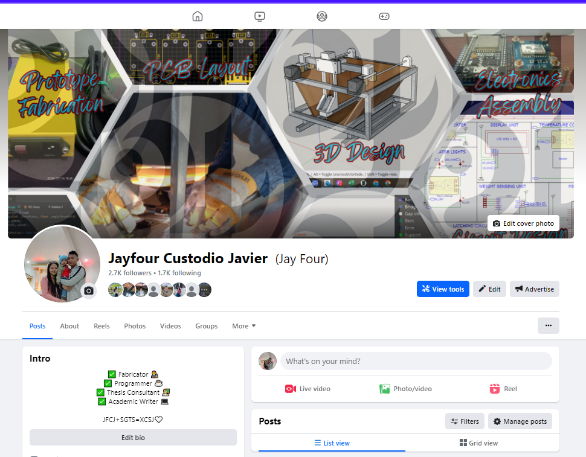
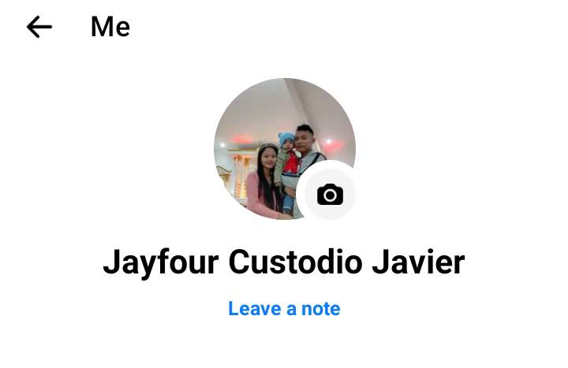
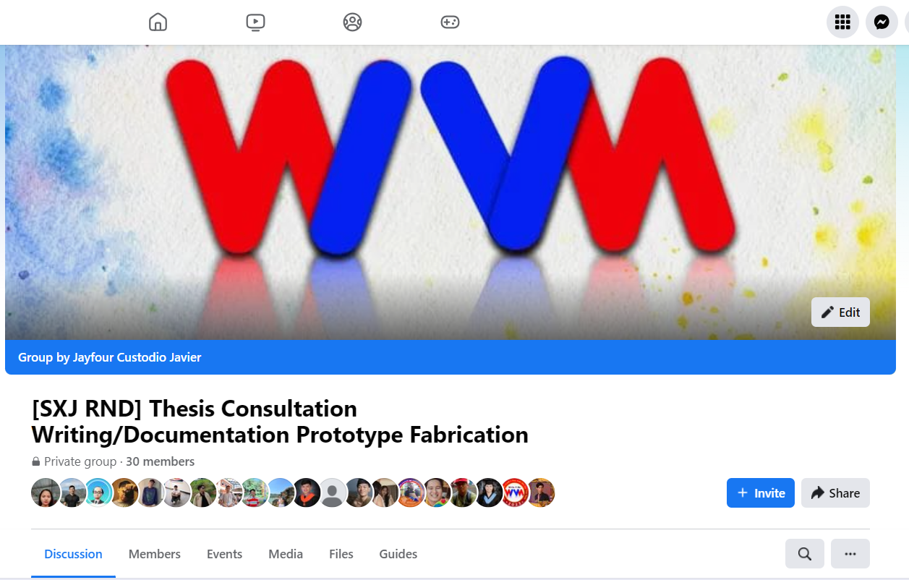
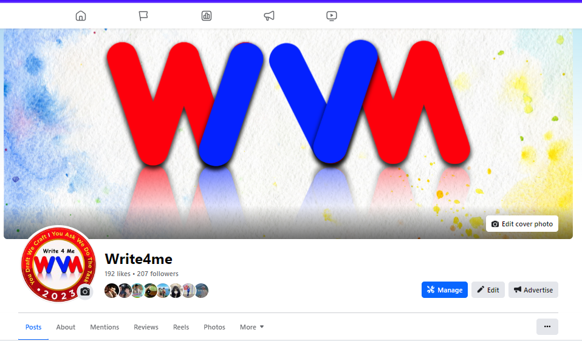
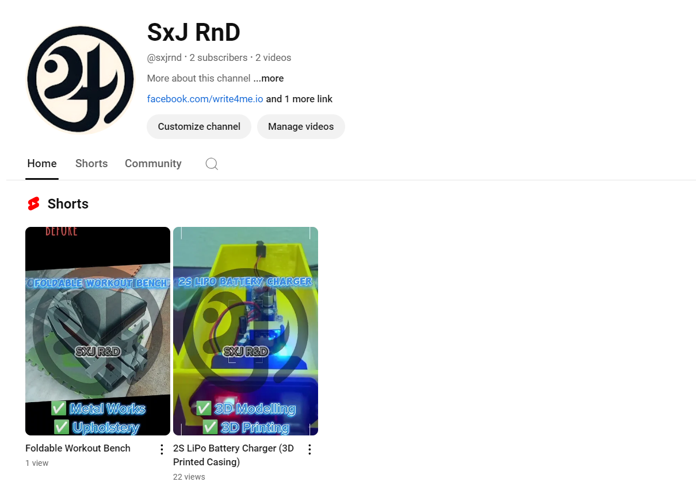

# SXJ Research Consultation, Documentation, and Prototype Fabrication

Hello! I'm [**Jay Four**](https://facebook.com/jfourjavier), a research consultant, fabricator, and programmer by profession. I offer a comprehensive thesis title consultation package designed to help you choose the best research title and prepare for your academic journey.
## Services 

### Thesis Title Consultation Package

### Research Consultation Package

### Engineering Design
- **3D Modelling** (Sketchup)
- **Circuit Diagram** 
- **Schematic Diagram**
- **Flowchart**
- **High Level Algorithm**

### Programming
- **Arduino**
    - Arduino Uno
    - Arduino Mega
    - Arduino Nano
    - Arduino Nano ESP32
- **ESP8266/ESP32**
    - NodeMCU ESP8266
    - NodeMCU ESP32
    - Wemos D1 ESP8266
    - Wemos D1 ESP32
    - Wemos D1 Mini ESP8266
    - Wemos D1 Mini ESP32
    - ESP32 Cam
- **Arduino IDE / Platform IO**
- **C++**
- **Documentation** - Markdown

### Prototype Fabrication
- **Metal Works**
    - **Types** (Bars, Sheets, Plates, Pipes)
    - **Skills** (Welding, Drilling, Grinding, Buffing, Painting)
    - **Materials** (Mild Steel,  Galvanized Iron (GI), Black Iron (BI), Stainless Steel, Aluminum)
    - **Prototype Casings**
    - **Prototype Structure/Frame**

- **Upholstery**
    - **Furnitures**
    - **Gym Equipment**

- **Woodworks**
    - **Prototype Casings**
    - **Prototype Structure/Frame**
    - **Furniture**

## FAQs

Please visit our FAQs for the different services we offer.

1. [Thesis Consultation Package - FAQs](#thesis-consultation-package---faqs)


## Contact Us

Just `tap` or `click` the images.


[**Facebook Profile**  ](https://facebook.com/jfourjavier)

[**Messenger** ](https://m.me/jfourjavier)

[**[SXJ RND] Thesis Consultation Writing/Documentation Prototype Fabrication** (Group) ](https://facebook.com/groups/sxjrnd.thesisdocsandprototype.ph)

[**Write4me** (Page) ](https://facebook.com/write4me.io/) - for research writing and documentation

[**SxJ RnD** (YouTube Channel)  ](https://www.youtube.com/@sxjrnd)

Feel free to reach out to me through the links above for more information or to schedule a consultation.


## Thesis Consultation 

### Package Inclusion:

1. **Research Project Assessment**  
   I will evaluate several important factors to help you choose the best research title.

2. **Video Conference Consultation**  
   Via Google Meet, I will personally explain EVERYTHING about the research title I create for you, such as:
   - Research gap/novelty
   - Possible objectives and methodologies
   - Coaching on defending the research title to your professor or adviser, including formulating possible questions and answers.

3. **Chat Support**  
   My service continues even after the consultation meeting. For additional concerns, my Messenger inbox is open for your questions. Please provide as much context as possible for appropriate responses.

### Thesis Consultation Package - FAQs

1. **How much is your title consultation package?**  
   The package has a one-time service fee of 1000 pesos. This allows you to focus on other academic tasks without worrying about your research title.

2. **What if the title you provided doesn't get approved?**  
   The service fee is a one-time payment. I will be your consultant until your research title gets approved, with no additional charges.

3. **Do you provide a research proposal paper?**  
   I provide a standard research title summary, including the proposed title, a brief discussion, and objectives. For a full research proposal paper, you can avail of my thesis proposal writing package, priced according to your school's format.

4. **What is the mode of payment and when do we have to pay?**  
   Payment is via GCash only. Please send a screenshot of the transaction receipt through my personal Messenger account. Payment is required before the consultation meeting.

5. **What is the assurance that you are not a scammer?**  
   This is my primary source of income. You can verify my identity through my Facebook profile (reels, highlights, photos). I transact using my "Real Account," as shown in my [```"Credentials"```](https://facebook.com/stories/2108864639499156/?source=profile_highlight) and [```"Agri-Achievement"```](https://web.facebook.com/stories/377671760321409/?source=profile_highlight) highlights. Feel free to publicly post on social media if I fail to provide the services mentioned. Ensure you have enough evidence, such as GCash receipts and videos, to support your claim. False allegations will be sued for cyber libel.

6. **How long should we wait for your chat support?**  
   I check my [```Messenger```](https://m.me/jfourjavier) inbox every hour and reply immediately or within a day, especially if I'm working on a rush project. For real-time support, inform me at least a day prior. Don't overthink if you don't receive an immediate reply.

By availing of my thesis title consultation package, you agree to the policies discussed above.Here's the updated version, following the syntax of the first entry:


Maintained by
**Jay Four C Javier**
Research Consultant

